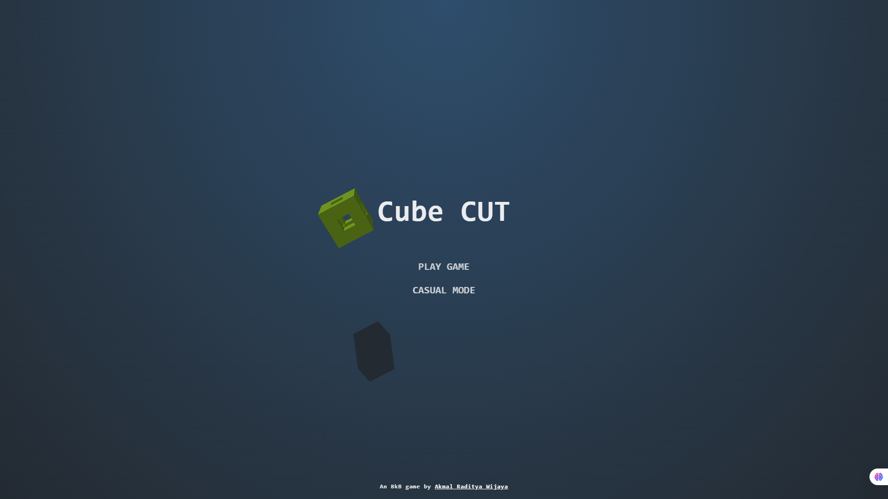

# 🧊 Cube CUT - 3D Cube Smashing Game



## 📜 Table of Contents

- [🎮 Game Overview](#-game-overview)
- [✨ Key Features](#-key-features)
- [🕹️ How to Play](#-how-to-play)
- [⚙️ Game Mechanics](#-game-mechanics)
- [💻 Technical Implementation](#-technical-implementation)
- [⚡ Performance Optimizations](#-performance-optimizations)
- [📥 Installation](#-installation)
- [🛠️ Development Guide](#-development-guide)
- [🤝 Contributing](#-contributing)
- [📜 License](#-license)
- [🙏 Credits](#-credits)

---

## 🎮 Game Overview

**Cube CUT** is an immersive 3D cube smashing game built entirely with vanilla JavaScript and HTML5 Canvas.  
Experience the thrill of slicing through colorful cubes with precise swipes while enjoying stunning visual effects and dynamic gameplay.

---

## ✨ Key Features

### 🎯 Core Gameplay

**Dual Game Modes:**

- 🏆 **Competitive Ranked Mode**: Game ends if cubes escape  
- 😌 **Relaxed Casual Mode**: Score penalties instead of game over

**Progressive Difficulty:**

- Spawn rate increases with score  
- Special cubes appear after certain thresholds

### 🧊 Cube Types

| Type       | Appearance       | Behavior                    | Points   |
|------------|------------------|-----------------------------|----------|
| Normal     | Solid color      | Standard movement           | +10      |
| Strong     | Thick outline    | Requires 3 hits             | +30 total|
| Slow-mo    | Wireframe (Blue) | Triggers slow-motion        | +10      |
| Spinner    | Standard         | Rotates rapidly             | +10      |

### 💥 Visual Effects

- Particle explosion when cubes are smashed  
- Dynamic lighting based on surface angles  
- Realistic shadows cast on backboard  
- Touch/swipe trails with fading effect  
- Camera-close fadeout effect  

---

## 🕹️ How to Play

### Basic Controls

- **Mouse/Touch**: Swipe across cubes to smash them  
- **Pause**: Click pause button or press `'P'` key

### Scoring System

- Normal hit: **+10 points**  
- Glancing hit: **+5 points**  
- Strong cube: **+10 per hit** (3 hits required)  
- Cube escape:
  - Casual Mode: **-25 points**
  - Ranked Mode: **Game Over**

### Pro Tips

- Chain hits during slow-motion for bonus points  
- Aim for the center of cubes for reliable hits  
- Watch spinning cube patterns for timing  
- Prioritize blue cubes to trigger slow-motion  

---

## ⚙️ Game Mechanics

### Cube Physics (Simplified)

```javascript
function updateCube(cube) {
  cube.x += cube.xD * deltaTime;
  cube.y += cube.yD * deltaTime;

  cube.yD += gravity * deltaTime;

  cube.xD *= (1 - airDrag * deltaTime);
  cube.yD *= (1 - airDrag * deltaTime);

  if (cube.y > screenBottom) {
    handleCubeEscape(cube);
  }
}
```

### Special Effects

- **Slow-motion**: Activated by blue wireframe cubes  
  - Lasts 1.5 seconds  
  - Slows movement to 30% speed  
  - Spawns 2 bonus cubes

---

## 💻 Technical Implementation

### Architecture Overview

- **3D Rendering Engine**
  - Custom matrix transformations
  - Perspective projection
  - Depth-sorted polygon rendering
  - Lighting calculations

- **Entity Management**
  - Object pooling for cubes/fragments
  - Hierarchical state system

- **Physics System**
  - Velocity-based movement
  - Collision detection
  - Boundary handling

---

## ⚡ Performance Optimizations

### Memory Management

```javascript
const cubePool = new Map();

function getCube() {
  if (cubePool.size > 0) {
    return cubePool.pop();
  }
  return new Cube();
}

function returnCube(cube) {
  cube.reset();
  cubePool.push(cube);
}
```

### Rendering Optimizations

- Batch processing of all elements  
- Early culling of off-screen objects  
- Pre-computed lighting  
- Minimal canvas state changes  

---

## 📥 Installation

### Web Version

```bash
git clone https://github.com/yourusername/cube-cut.git
```

Open `index.html` in any modern browser.

### Progressive Web App

Visit [game URL] on mobile and "Add to Home Screen" for fullscreen experience.

---

## 🛠️ Development Guide

### File Structure

```
cube-cut/
├── index.html        # Main game file
├── style.css         # Styles and animations
├── script.js         # game system
└── screenshot.png    # Promotional image
```

### Building

No build step required. Works out-of-the-box in modern browsers.

### Extending the Game

- Add new cube types in `getTarget()` function  
- Modify game settings in `globalConfig.js`  
- Enhance visuals in `draw()` function  

---

## 🤝 Contributing

We welcome contributions!  

1. Fork the repository  
2. Create a new branch:

```bash
git checkout -b feature/amazing-feature
```

3. Commit your changes:

```bash
git commit -m 'Add amazing feature'
```

4. Push and open a Pull Request:

```bash
git push origin feature/amazing-feature
```

---

## 📜 License

MIT License - Free for personal and commercial use.

---

## 🙏 Credits

- **Developed by**: Akmal Raditya Wijaya  
- **Special Thanks**:  
  - Playtesters  
  - Open source community  
  - Coffee ☕